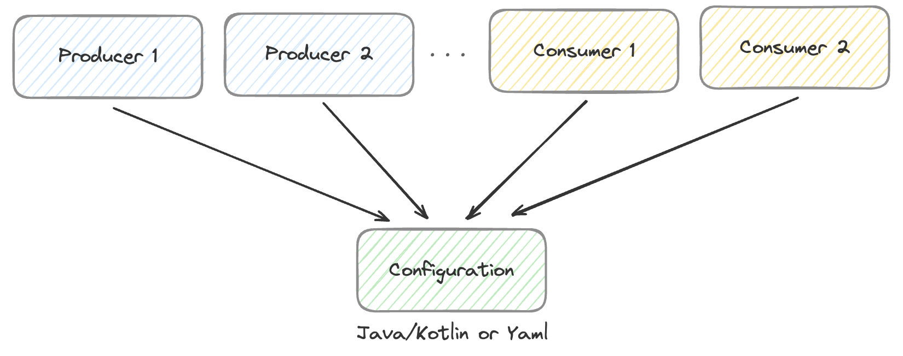
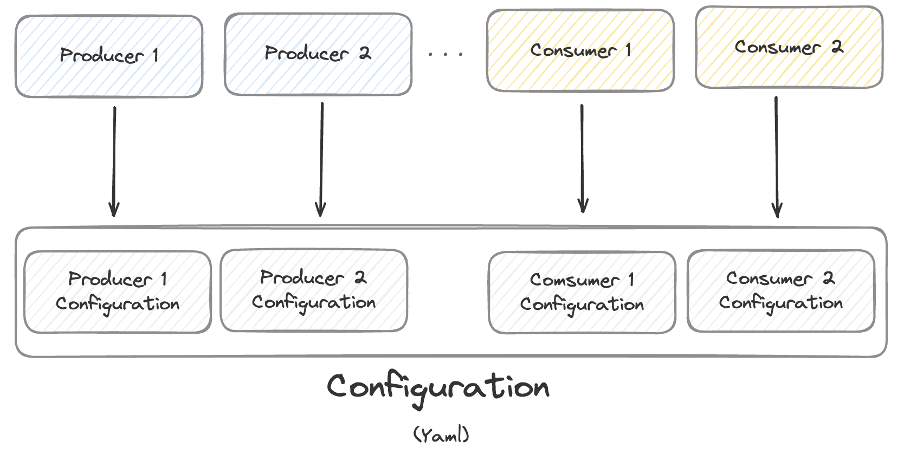

# Spring kafka in actions
## Spring Kafka vs Spring Cloud Stream
### Spring Kafka vs Spring Cloud Stream

|                                                      Spring Kafka                                                      |      비교      |                              Spring Cloud Stream                              |
|:----------------------------------------------------------------------------------------------------------------------:|:------------:|:-----------------------------------------------------------------------------:|
|                                                    **kafka-client**                                                    |     의존성      |                               **spring-kafka**                                |
|                                                                              | Config 설정 방법 |                       |
| Configuration 을 정의하고, producer 또는 comsumer 가 해당 설정을 향하게 함<br><br>별도의 설정이 필요한 경우 새로 더 만들어서 할당<br><br>Configuration을 재활용 |              |         하나의 큰 Configuration을 정의하고, 세부적으로 producer 또는 consumer의 설정을 정의         |
|                                             **비교적 낮음**<br><br>카프카 지향적으로 정의                                             |    추상화 정도    | **비교적 높음**<br><br>카프카 외에도 다양한 메시징 시스템을 지원하기 위한 용어 선택 및 설정(e.g. RabbitMQ, ...) |
|                                                        비교적 적음                                                          |   설정 수정 빈도   |                                    비교적 많음                                     |


## Container endpoints
```yaml
docker-compose up -d
```

#### Kafka
- http://localhost:9092
- http://localhost:9093
- http://localhost:9094

#### Zookeeper
- http://localhost:2181

#### Monitoring
- kafka-ui: http://localhost:8081
- CMAK: http://localhost:9000
- Kowl: http://localhost:8989

#### Mysql
- http://localhost:13306
  - root password: 1234
  - database: kafka-practice